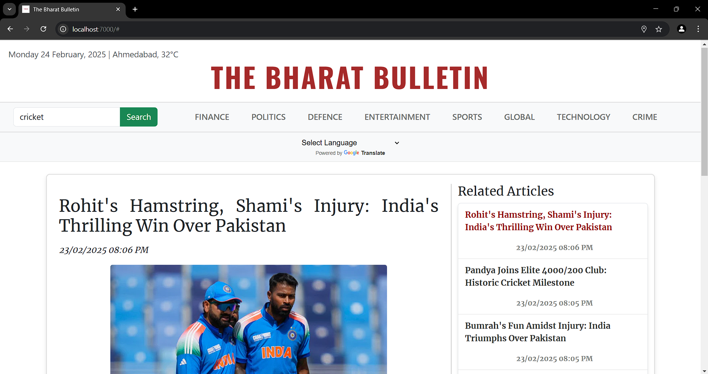

# 🚀 **The Bharat Bulletin is Live!** 🌍

Exciting news! **The Bharat Bulletin** is now live and accessible online! You can check out the latest news and updates here:

🔗 [Visit The Bharat Bulletin Now](https://the-bharat-bulletin.onrender.com/#)


# India-Feed-AI

Welcome to **India-Feed-AI**, the core engine behind our prototype, **The Bharat Bulletin**. This repository powers the website's logic, handling everything from news scraping to AI-driven summarization.



## 📂 Directory Structure
We use **Flask** for rapid prototyping and follow a structured directory layout:

### 🔹 `static/`
Stores all static assets:
- `styles/index.css` – Client-side CSS
- `scripts/index.js` – Client-side JavaScript
- `img/logo.png` – Website logo

### 🔹 `templates/`
Contains `index.html`, the primary frontend of the website.

### 🔹 `agent/`
Handles AI-driven summarization and title generation:
- `system/` – Stores system prompts for article summarization and title generation
- `inference_core.py` – Interface for interacting with the LLM
- `summarizer.py` – Summarization logic binding

### 🔹 `webscraper/`
Manages web scraping and routing:
- `src/routes/` – Defines all valid API routes
- `src/controller/newsController.js` – Handles news-related requests
- `src/services/webScrapingService.js` – Scrapes news from [India Today](https://www.indiatoday.in)
- `app.js` – Manages client interactions
- `app_cron.js` – Manages interactions and scraping requests by our agent

### 🔹 Root Directory
- `server.py` – Runs the Flask web server
- `process_scheduler.py` – CRON job automation for fetching, summarizing, and storing news in MongoDB


This brings together **web scraping, AI summarization, and automation** to deliver concise news updates efficiently.

## 🤖 LLM Used and Why
We opted for the **cloud-hosted Gemini API 1.5 - Flash** due to its balance of affordability, quality, and performance. Key reasons for our choice:

- **Generous Free Tier**: Provides **15 Requests Per Minute (RPM)** and **1500 free Requests per Day**.
- **No Hosting Hassles**: Eliminates the complexity of self-hosting an open-source LLM like **Gemma 2** on a cloud instance.
- **High-Quality Responses**: Maintains a strong standard of AI-generated summaries without compromise.
- **Cost-Effective**: Nearly free, making it an excellent choice for startups and prototyping.
- **Unmatched Speed**: Ensures quick response times, ideal for real-time summarization.

### ⏳ Optimized Automation
To stay well within the free-tier limits, we have carefully tuned our **automation jobs**. The `process_scheduler.py` script updates our database **10 times a day** at the following hours:

- **3 AM, 6 AM, 10 AM, 12 PM, 2 PM, 4 PM, 6 PM, 8 PM, 10 PM, 12 AM**

Each job covers the following **8 topics**:
- **Finance**
- **Politics**
- **Defence**
- **Entertainment**
- **Sports**
- **Global**
- **Technology**
- **Crime**

At most **5 articles per topic** are gathered per session, meaning a maximum of **40 articles per run**. With **10 runs per day**, we collect at most **400 articles daily**, using only **27% of the free-tier limit** while maintaining an excellent balance of quality and quantity.

### 💡 Cost Efficiency
- The **LLM API is only triggered upon request**, ensuring we incur no unnecessary overhead costs.
- If we were to use an **open-source LLM** on a cloud instance, we would face **idle-time billing** and **higher infrastructure costs** to maintain speed and quality.
- By leveraging **Gemini API 1.5 - Flash**, we get **cost-effective, high-speed inference without needing powerful hardware**.

## 🧠 Core Logic: The Autonomous AI Agent
The `process_scheduler.py` script runs **indefinitely** once started and handles the automation process. Here’s how it works over a day:

- Executes **10 times daily** at predefined hours (as detailed above).
- Interacts with `cron_app.js` to **fetch web articles in raw JSON format**, leveraging `webScrapingService.js`.
- Uses `summarizer.py` to **generate summaries and catchy titles** for the fetched articles.
- Stores the **summarized content and title** in a collection in the relevant database hosted on **MongoDB Atlas Cloud**, ensuring seamless access to fresh articles.
- All automation is powered by **BlockingScheduler from APScheduler**, ensuring reliable, scheduled execution.
- When users visit the site, they **instantly see the latest articles** thanks to **server-side rendering with Jinja2 and Flask templating**, eliminating the need for manual publishing.

## 🛠️ Testing & Setup
To test and run this project locally, follow these steps:

### 1️⃣ Clone the Repository
```sh
git clone https://github.com/0ameyasr/India-Feed-AI
```

### 2️⃣ Install Dependencies
- **Python Requirements**: Install all necessary Python dependencies from `python-requirements.txt`
  ```sh
  pip install -r python-requirements.txt
  ```
- **Web Scraper Dependencies**: Navigate to the `webscraper/` directory and install Node.js dependencies:
  ```sh
  cd webscraper
  npm install
  ```

### 3️⃣ Start the Services
- Start the **Flask Server** (runs on port `7000`):
  ```sh
  python server.py
  ```
- Start the **Web Scraper Services**:
  ```sh
  nodemon src/app.js   # Runs on port 7070
  nodemon src/app_cron.js  # Runs on port 5000
  ```
- Start the **AI Agent** (background automation process):
  ```sh
  python process_scheduler.py
  ```

### 4️⃣ Access the Website
Open your browser and visit:
```
http://localhost:7000
```
You're now ready to interact with **The Bharat Bulletin**! 🚀

## 🌟 Additional Features

### 🔍 Search Functionality
- Users can **search for a topic** to find relevant articles quickly.


### 📺 Trending Videos
- Displays **most searched and played videos** from **India Today** to keep users updated on trending news.


### 🌎 Google Translate Integration
- Integrated **Google Web Translate Widget** allows users to **translate articles into any language**, enhancing accessibility for diverse audiences.


## ⚠️ Considerations & Security Measures

- **Search Limitations**: The search feature may not always return results because articles are scraped from external sources, and some sites may restrict access.
- **Freshness of Articles**: The `process_scheduler.py` script may not always fetch new articles if no relevant updates are available.
- **Environment Variables**: We use confidential environment variables to store credentials:
  ```sh
  GOOGLE_GENAI_API_KEY=<your_api_key>
  MONGO_URI=<your_mongo_uri>
  WEBSCRAPER_API_URL=http://localhost:5000/api/news/fetch-news
  ```
- **Setting Up Google Gemini API Key**:
  1. Go to [Google AI Studio](https://aistudio.google.com/)
  2. Sign in and generate an API key
  3. Set it as a system environment variable on Windows:
     ```sh
     setx GOOGLE_GENAI_API_KEY "your_api_key"
     ```
- **MongoDB URI Format**:-
  1. Ensure you have a **new cluster** or **existing database** ready for updates.  
  2. In your selected cluster, create a database named **IndiaFeed**.  
  3. Inside **IndiaFeed**, create two collections: **articles** and **trending_videos**.  
  4. Copy the connection string and verify connectivity (check network security settings).  
  ```sh
  mongodb+srv://<username>:<password>@cluster0.mongodb.net/?retryWrites=true&w=majority
  ```
  5. Additionally, store it in an environment variable **MONGO_URI** on your local (Windows) system.
     
- **Keeping Credentials Safe**: Storing API keys in environment variables prevents accidental exposure in source code.
- **NOTE**: We **cannot leak** the credentials we used because this is a **public** repository. **_We apologize for any inconvenience caused in this regard._**
- **NOTE**: One common issue during setup is that the keys are not being used or throwing errors, especially when using VSCode. In any such cases, you are encouraged to restart VSCode and try again. This will almost always resolve any missing key issues. 
